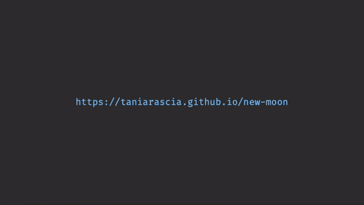

# ghpages-to-repo



Let's say you're browsing a GitHub Pages website, but now you want to go to its repository. Just add `gotorepo.vercel.app/` in front of the URL!

```sh
https://taniarascia.github.io/new-moon
# will become...
https://gotorepo.vercel.app/taniarascia.github.io/new-moon
        ^^^^^^^^^^^^^^^^^^^^
```

You'll be redirected to the repository :)
